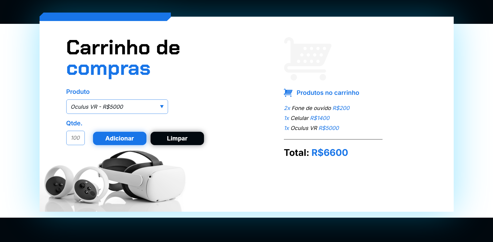

# Carrinho de Compras 🛒

Este é um projeto simples de carrinho de compras desenvolvido com HTML, CSS e JavaScript.

## 📸 Demonstração

## 🚀 Funcionalidades

- **Adição de Produtos**: Escolha um produto, insira a quantidade e adicione ao carrinho.
- **Limpeza do Carrinho**: Limpe todos os produtos adicionados com apenas um clique.
- **Cálculo Automático do Total**: O total dos produtos no carrinho é calculado automaticamente.
- **Interface Intuitiva**: Design limpo e funcional.

## 🛠️ Tecnologias Utilizadas

- **HTML5** para a estrutura do projeto.
- **CSS3** para a estilização e responsividade.
- **JavaScript** para as funcionalidades dinâmicas.
